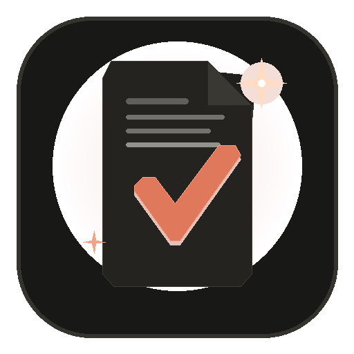
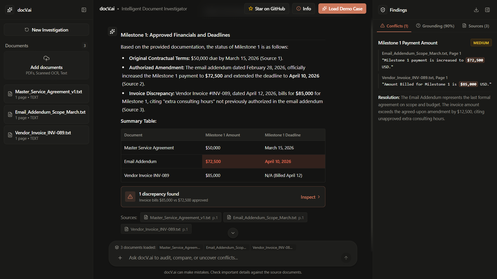
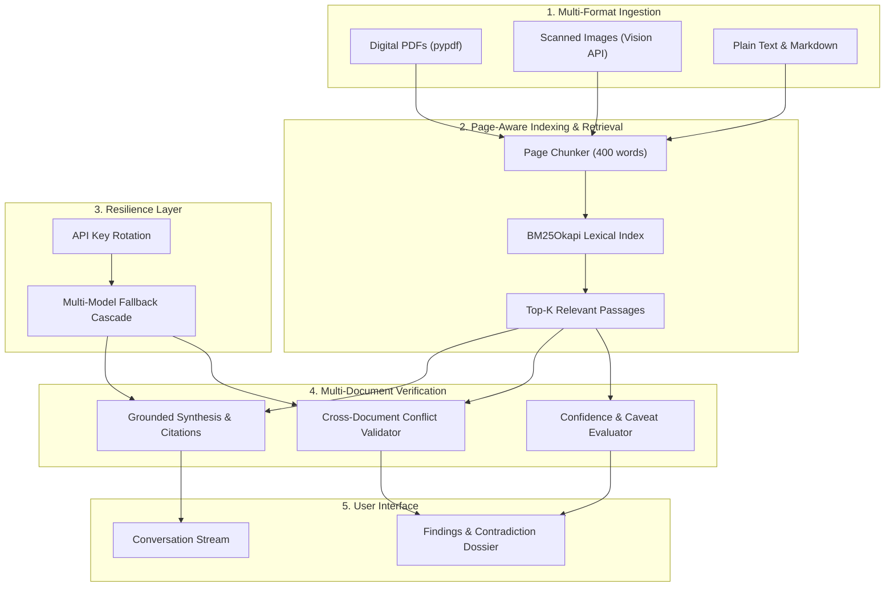
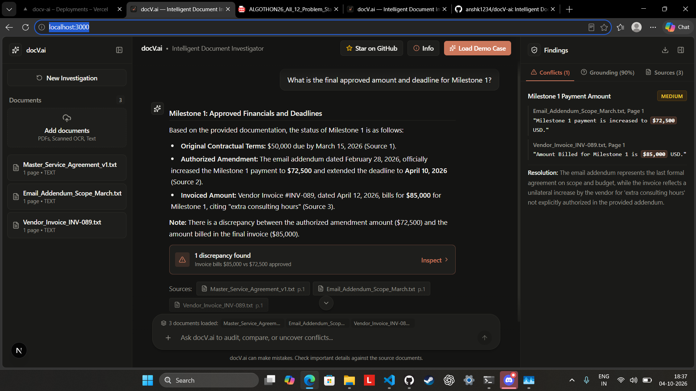
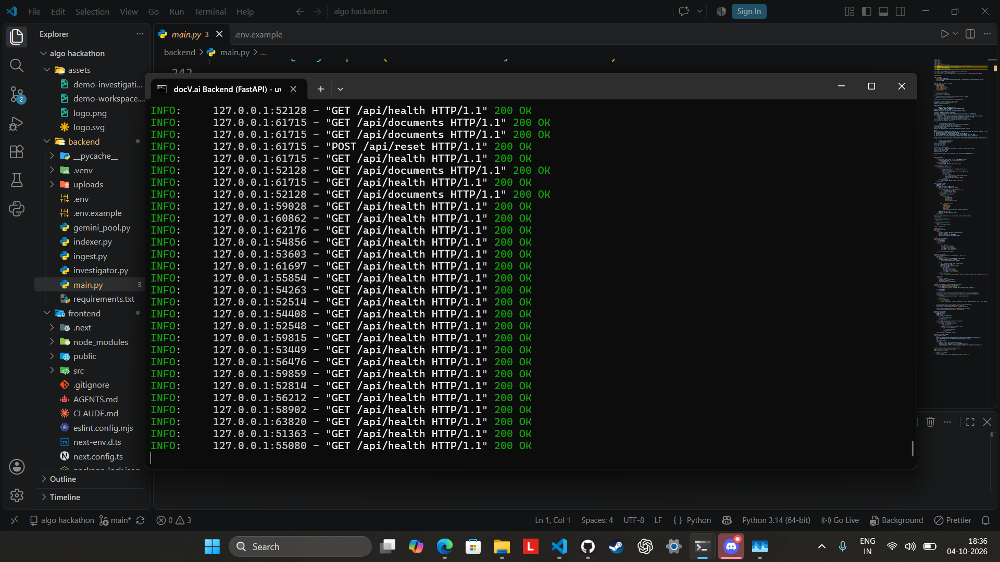
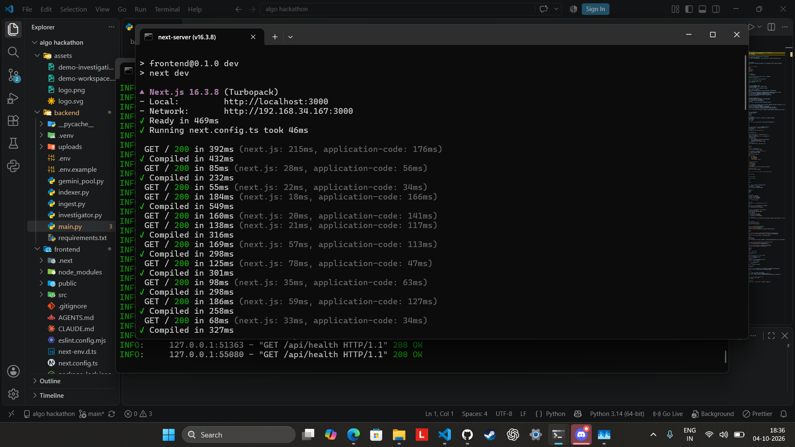
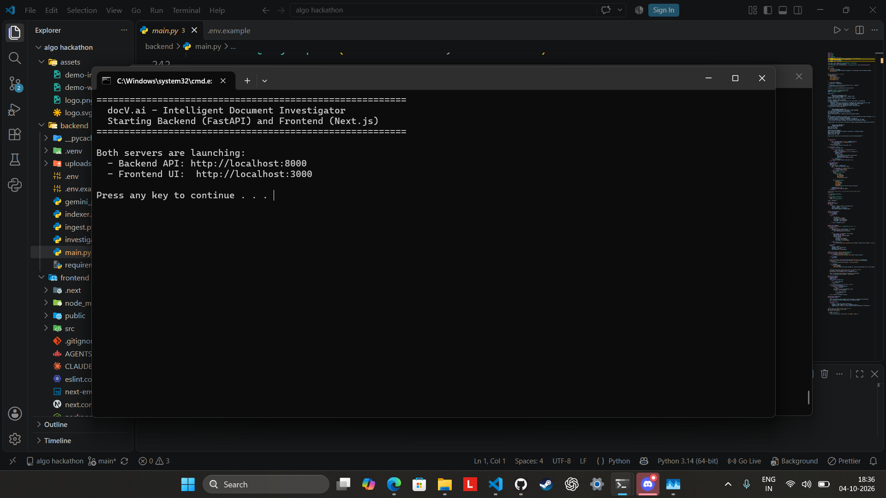

<div align="center">



# docV.ai

**Intelligent Document Investigator & Cross-Document Contradiction Engine**  
ALGOTHON 26 Official Problem Statement ID: `ALG-AI-02` (AI / ML Track)

[Deployed App](https://docv-ai.vercel.app)

[](https://docv-ai.vercel.app)
[](https://nextjs.org)
[](https://fastapi.tiangolo.com)
[](https://www.python.org)
[](LICENSE)

<br/><br/>

[](https://docv-ai.vercel.app)

</div>

## What It Does

Information in organizations is frequently dispersed across digital PDFs, scanned documents, and text files that may contain contradictory terms, shifting deadlines, or altered pricing. Traditional search tools and single-document question-answering systems either summarize text uncritically or hallucinate resolutions when sources disagree. docV.ai ingests heterogeneous document collections, retrieves relevant passages using page-aware lexical search, and performs structured multi-document reasoning. It answers factual queries with verbatim citations, isolates cross-document contradictions with severity ratings, and reports calibrated uncertainty scores.

## Requirements Coverage

| ALG-AI-02 Requirement | Implementation in docV.ai |
| :--- | :--- |
| Multiple document formats | Ingests digital PDFs via pypdf, images via Gemini Vision, and plain text/markdown. |
| Extraction / indexing | Splits text into 400-word page-tagged chunks indexed with BM25Okapi for retrieval. |
| Natural-language Q&A | Generates structured markdown answers strictly grounded in retrieved passages. |
| Source references | Returns document names, page numbers, and exact verbatim quotation snippets. |
| Conflict detection | Flags contradictory claims across distinct files with claim comparison and resolution notes. |
| Uncertainty handling | Outputs confidence score (0-100), uncertainty level, and explicit factor explanations. |
| Innovation bonus | Detects multi-document discrepancies and communicates uncertainty instead of picking one answer. |

## Architecture



### Key Technical Decisions
- Page-aware chunking: Chunks are bounded to 400 words with 50-word overlap while preserving document ID and page number for exact citation tracking.
- BM25 retrieval: Selected for deterministic lexical matching of contract terms, dates, and currency values without vector index overhead.
- Cross-document conflict validation: An automated filter ensures contradictions are only flagged between distinct files, preventing false positive comparisons within the same document.
- Calibrated uncertainty scoring: The engine evaluates excerpt sufficiency and source alignment to generate a confidence percentage and specific caveat reasons.
- Key rotation and model fallback: Requests rotate across configured API keys and fall back through tiered models for resilience under load.

## Demo Walkthrough

1. Open https://docv-ai.vercel.app.
2. Click "Load Demo Case" to load three synthetic files: Master_Service_Agreement_v1.txt, Email_Addendum_Scope_March.txt, and Vendor_Invoice_INV-089.txt.
3. The platform runs the default query: "What is the final approved amount and deadline for Milestone 1?".
4. View the synthesized answer explaining the baseline $50,000 agreement, the $72,500 approved addendum, and the unapproved $85,000 invoice.
5. Click "Findings" to inspect 1 discrepancy: "Milestone 1 Payment Amount" (Medium severity, $72,500 vs $85,000), 85-90% confidence with Moderate uncertainty, and 3 verifiable page citations.

## Testing and Edge Cases

| Test Case | Expected Behavior | Actual Result |
| :--- | :--- | :--- |
| Demo case (3 contradictory files) | Detect discrepancy between addendum and invoice | 1 discrepancy ($72.5k vs $85k), 3 citations, 85% confidence |
| Conversational inputs (e.g. "hi", "perfect") | Direct conversational reply without hallucinating document audits | 200 OK, polite assistant response, empty citations/conflicts |
| Multi-page digital PDF | Page-aware extraction with accurate page numbering | Verified on 5-page official rulebook with page citations |
| Missing API key configuration | Safe fallback message without application crash | 200 OK, graceful configuration notice and simulated citations |
| Empty document store query | Clear guidance prompting document upload or demo case | Handled gracefully without unhandled exception |
| Same-document internal sections | Excluded from conflict detection | Verified, zero false-positive intra-document contradictions |

## Known Limitations and Future Improvements

- Lexical retrieval: BM25 depends on keyword overlap; queries with complex semantic paraphrasing and no shared terms may retrieve suboptimal excerpts.
- Vision OCR dependence: Scanned document text extraction requires external model vision API availability.
- In-memory index: Document storage and the BM25 index reside in memory and local file cache, resetting when the server instance restarts.
- Single-turn queries: Context is evaluated per investigation query rather than multi-turn conversational history.
- Grounding estimation: Confidence scores are estimated via model reasoning evaluation rather than formal mathematical proof.

Future work includes dense vector embeddings for hybrid retrieval, persistent database storage (PostgreSQL/pgvector), automated table parsing, and batch PDF report exports.

## Setup

Prerequisites: Node.js 18+, Python 3.10+, Google Gemini API key.

Quick start (Windows):
```bat
run_dev.bat
```

Manual setup:
```bash
# Backend
cd backend && python -m venv .venv && .venv\Scripts\activate && pip install -r requirements.txt && uvicorn main:app --reload --port 8000

# Frontend
cd frontend && npm install && npm run dev
```

Environment variables in `backend/.env`:
- `GEMINI_API_KEY`: Primary API key.
- `GEMINI_API_KEYS`: Optional comma-separated keys for key rotation.

## Disclosures

- External APIs and models used: Google Gemini API (gemini-2.5-flash, gemini-3.8-flash, gemini-flash-latest, gemini-3.1-flash-lite, gemini-2.5-flash-lite).
- Third-party libraries: FastAPI, Uvicorn, Pydantic, pypdf, pdfplumber, rank-bm25, Pillow, Next.js, React, Tailwind CSS, Lucide React, react-markdown, remark-gfm, @vercel/analytics.
- Datasets: Demo case documents (Master Service Agreement, Email Addendum, Vendor Invoice) are synthetic test records created for this project.
- AI-assisted tools: Antigravity CLI and Gemini models were used for code generation, refactoring, and debugging.
- Equivalent technologies: Gemini Multimodal Vision API was used for image text extraction alongside pypdf for digital document processing as allowed by the problem statement guidelines.

## Project Structure

```
docV-ai/
├── backend/
│   ├── main.py              # FastAPI endpoints and demo dataset
│   ├── ingest.py            # PDF, image vision, and text ingestion
│   ├── indexer.py           # Page chunking and BM25 search
│   ├── investigator.py      # Q&A synthesis, conflict detection, uncertainty scoring
│   ├── gemini_pool.py       # Key rotation and model fallback manager
│   └── requirements.txt     # Python dependencies
├── frontend/
│   ├── src/app/
│   │   ├── layout.tsx       # Root layout and metadata
│   │   └── page.tsx         # Three-pane investigation interface
│   └── package.json         # Frontend dependencies (Next.js 16.3.8)
├── assets/                  # Documentation images and icons
├── run_dev.bat              # Local development launcher
├── README.md
└── LICENSE                  # MIT License
```

## Testing

Visual verification of platform test runs across backend API endpoints, frontend compilation, launcher orchestration, and end-to-end multi-document contradiction workflows:

<p align="center">
  
</p>

*End-to-end investigation Q&A run on localhost:3000 showing 1 discrepancy, 90% grounding, and 3 citations.*

<p align="center">
  
  
</p>

*Backend API health and reset logs (left) and Next.js Turbopack compilation response times (right).*

<p align="center">
  
</p>

*Dual-server startup execution via Windows run_dev.bat.*


*Vercel deployement.*

## License

MIT License.
