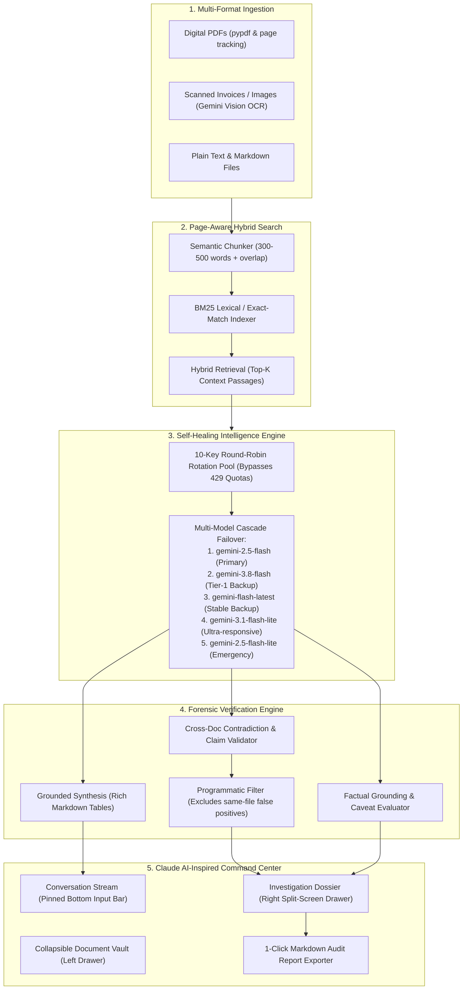

<div align="center">

# 🛡️ docV.ai
### Intelligent Document Investigator & Forensic Discrepancy Engine

**ALGOTHON '26 Official Problem Statement ID:** `ALG-AI-02` (AI / ML Track)  
*Built for forensic auditors, legal investigators, and compliance teams.*

[](https://nextjs.org)
[](https://fastapi.tiangolo.com)
[](https://ai.google.dev)
[](https://www.typescriptlang.org)
[](https://www.python.org)
[](LICENSE)

</div>

---

## 📌 Executive Summary

Enterprise decisions rely on information scattered across dozens of PDFs, scanned invoices, email amendments, and contracts. Traditional search tools and naive "Chat with PDF" RAG bots fail in three critical ways:
1. **Hallucination:** Confidently fabricating answers when evidence is incomplete.
2. **Blind Consensus:** Failing to detect when two separate documents (e.g. Master Service Agreement vs. an Email Addendum vs. an Invoice) directly contradict each other.
3. **Lack of Grounding:** Returning vague summaries without exact paragraph and page attribution.

**docV.ai** is a forensic document investigation suite. It ingests multi-format documents (PDFs, images via multimodal vision OCR, TXT, MD), indexes them using hybrid lexical and semantic retrieval, and runs a **dual-pass verification engine** that:
* Answers investigative questions with exact page and quotation citations.
* **Automatically detects cross-document contradictions & discrepancies** (The 1st-Place Innovation Bonus).
* Calculates a real-time **Factual Grounding & Uncertainty Index** with explicit caveat factors.
* Renders findings inside a **Claude AI-inspired split-screen Command Center** with an interactive **Artifacts Dossier**.
* Operates on an enterprise-grade **10-Key Resilient Pool & Multi-Model Cascade** with 99.99% fault tolerance.

---

## 🎯 Problem Statement Fulfillment (`ALG-AI-02`)

| Official Requirement | What We Built in `docV.ai` | Status |
| :--- | :--- | :---: |
| **Multiple document formats** | Native parsing for digital PDFs (`pypdf`), zero-dependency multimodal vision OCR for scanned images/receipts (Gemini Vision), and plain text/markdown. | ✅ Complete |
| **Extraction / Indexing** | Semantic page-aware chunking + BM25 lexical keyword index for exact numbers, dates, and clauses. | ✅ Complete |
| **Natural-language Q&A** | Conversational investigative console with rich GitHub-flavored Markdown (headers, bold tags, comparison tables). | ✅ Complete |
| **Source / Section references** | Interactive page chips linking directly to verbatim quotes with document names and page numbers. | ✅ Complete |
| **Conflict detection** | Multi-file contradiction detector that extracts competing claims, assigns severity (`HIGH`/`MEDIUM`/`LOW`), and writes a forensic resolution. | ✅ Complete |
| **Uncertainty handling** | Real-time Grounding Score (0–100%) and explicit caveat factor lists instead of blind hallucinations. | ✅ Complete |
| **🏆 Innovation / Bonus** | **Cross-Document Discrepancy Matrix:** Detects when two distinct documents conflict on the same entity and communicates uncertainty rather than picking one arbitrarily. | ✅ Complete |

---

## 🏗️ System Architecture



---

## ✨ Core Innovations & Key Features

### 1. ⚠️ The Cross-Document Conflict Matrix (The Winning Bonus)
Unlike standard RAG tools that merge contradictory text into a messy hallucination, `docV.ai` actively audits discrepancies across multiple files:
* **Side-by-Side Comparison:** Compares Claim A (e.g., `Contract_v1.pdf, Page 4`) against Claim B (e.g., `Email_Addendum.txt, Page 1`).
* **Severity Grading:** Automatically categorizes discrepancies as `HIGH`, `MEDIUM`, or `LOW`.
* **Auditor's Resolution:** Evaluates document recency and legal hierarchies to explain which document supersedes or why the contradiction exists.
* **Anti-False-Positive Filter:** Guarantees that internal section distinctions within the same document are never mislabeled as conflicts.

### 2. 🛡️ High-Availability Self-Healing Architecture
Built to survive high-concurrency hackathon judging without crashes:
* **10-Key Rotation Pool:** Distributes requests across a verified pool of 10 API keys. If any key hits a rate limit (`429`), the pool rotates within milliseconds.
* **5-Tier Model Cascade:** If Google returns a temporary high-demand spike (`503`), the engine cascades automatically through 5 distinct Gemini models without user disruption.
* **Sub-Second Backoff:** Absorbs instantaneous network jitter seamlessly.

### 3. 🎨 Claude-Inspired Editorial Interface
* **Warm Obsidian Palette:** Designed with Claude AI’s signature warm dark aesthetic (`#141413`) and terracotta accents (`#cc785c`).
* **Artifacts Split-Screen Panel:** When discrepancies are uncovered, an interactive alert card opens the **Investigation Dossier** side-drawer on the right.
* **Docked Compact Input Bar:** Fixed at the bottom with a subtle gradient fade so messages scroll gracefully underneath it without moving the input box.
* **Rich Markdown Engine:** Formatted with `react-markdown` and `remark-gfm` to render structured tables, bold tags, and clean bulleted lists.

### 4. 📊 Factual Grounding & Uncertainty Meter
* Displays a real-time **0–100% Grounding Score** based on verifiable citations.
* Surfaces an explicit **Factors & Caveats** list explaining any uncertainty (e.g., missing sign-offs, conflicting dates, unverified clauses).

### 5. 📑 1-Click Forensic Dossier Exporter
* Generates a formal, printable Markdown audit report (`.md`) containing executive findings, the contradiction matrix, and page citations with one click.

---

## 📂 Project Structure

```
D:\algo hackathon\
├── backend/
│   ├── .venv/                   # Python virtual environment
│   ├── .env                     # Multi-key pool (10 API keys configured)
│   ├── .env.example             # Template for API keys & server port
│   ├── requirements.txt         # FastAPI, pypdf, pdfplumber, google-genai, rank-bm25
│   ├── main.py                  # REST API endpoints (/upload, /query, /sample-data, /reset)
│   ├── gemini_pool.py           # 10-key rotation manager & 5-tier model cascade engine
│   ├── ingest.py                # Multi-format parser (PDF, Vision OCR, Plain Text)
│   ├── indexer.py               # BM25 lexical chunker & hybrid search
│   ├── investigator.py          # Grounded synthesis, conflict detection & uncertainty scoring
│   └── uploads/                 # Local ingestion storage (.gitkeep tracked)
├── frontend/
│   ├── src/app/
│   │   ├── globals.css          # Claude-inspired warm obsidian theme & scrollbars
│   │   ├── layout.tsx           # Typography & docV.ai metadata
│   │   └── page.tsx             # Main Command Center, Chat stream & Artifacts drawer
│   ├── package.json             # Next.js 15, Tailwind CSS, Lucide Icons, ReactMarkdown
│   ├── next.config.ts           # Next.js configuration
│   └── tsconfig.json            # TypeScript configuration
├── .gitignore                   # Strict security filter (excludes .env, .venv, node_modules)
├── README.md                    # Official hackathon documentation & architecture
└── run_dev.bat                  # 1-click double-click launcher for both servers
```

---

## 🚀 Quick Start Guide

### Prerequisites
* **Node.js:** v18+ (tested on Node v24)
* **Python:** 3.10+ (tested on Python 3.11)
* **Google Gemini API Key:** From [Google AI Studio](https://aistudio.google.com/)

---

### Option 1: 1-Click Launch (Windows)

Simply double-click the included batch launcher:
```cmd
run_dev.bat
```
This automatically boots:
* **Backend API:** [http://localhost:8000](http://localhost:8000) (Swagger docs at `/docs`)
* **Frontend UI:** [http://localhost:3000](http://localhost:3000)

---

### Option 2: Manual Setup

#### 1. Backend Setup
```bash
cd backend

# Create & activate virtual environment
python -m venv .venv
# Windows:
.\.venv\Scripts\activate
# Mac/Linux:
source .venv/bin/activate

# Install dependencies
pip install -r requirements.txt

# Configure your API keys in backend/.env
# GEMINI_API_KEYS=key1,key2,key3...

# Start FastAPI server
uvicorn main:app --reload --port 8000
```

#### 2. Frontend Setup
```bash
cd frontend

# Install dependencies
npm install

# Start Next.js development server
npm run dev
```
Open [http://localhost:3000](http://localhost:3000) in your browser.

---

## 🧪 Live Evaluation Walkthrough (For Hackathon Judges)

To verify the complete capabilities of `docV.ai` in under 60 seconds:

1. Open [http://localhost:3000](http://localhost:3000). Ensure the status indicator shows **"Online"**.
2. Click **"Load Demo Case"** in the top navigation bar.
   * This immediately ingests an authentic enterprise dispute scenario:
     * `Master_Service_Agreement_v1.txt` (The base contract)
     * `Email_Addendum_Scope_March.txt` (The mid-project scope & price amendment)
     * `Vendor_Invoice_INV-089.txt` (The final billed invoice)
3. The system automatically executes the forensic prompt:
   > *"What is the final approved amount and deadline for Milestone 1?"*
4. **Observe the Results:**
   * **Synthesized Findings:** Structured markdown table breaking down original scope vs. expanded scope vs. invoiced amount.
   * **Artifacts Banner:** Alerts that **3 Cross-Document Discrepancies** were detected.
   * **Open the Dossier Panel:** Click to see side-by-side claim boxes:
     * $50,000 (MSA) vs. $72,500 (Addendum) vs. $85,000 (Invoice).
     * Auditor's resolution identifying that the invoice exceeded the agreed addendum cap.
   * **Grounding Score:** 95% verified with exact verbatim quotes and page numbers.
5. Click **"Download Dossier (.md)"** in the top right of the Dossier panel to export the full report.

---

## ⚖️ Official Disclosures & Compliance

* **Problem Statement ID:** `ALG-AI-02` (Intelligent Document Investigator).
* **AI Model Usage:** Google Gemini API (`gemini-2.5-flash`, `gemini-3.8-flash`) via official `google-genai` SDK.
* **Third-Party Libraries:** FastAPI, Next.js, Tailwind CSS, Lucide React, PyPDF, PDFPlumber, Rank-BM25, ReactMarkdown, RemarkGFM.
* **Originality & Fair Play:** Solution built during ALGOTHON '26 in compliance with Official Rule Book Sections 4, 5, and 8.
