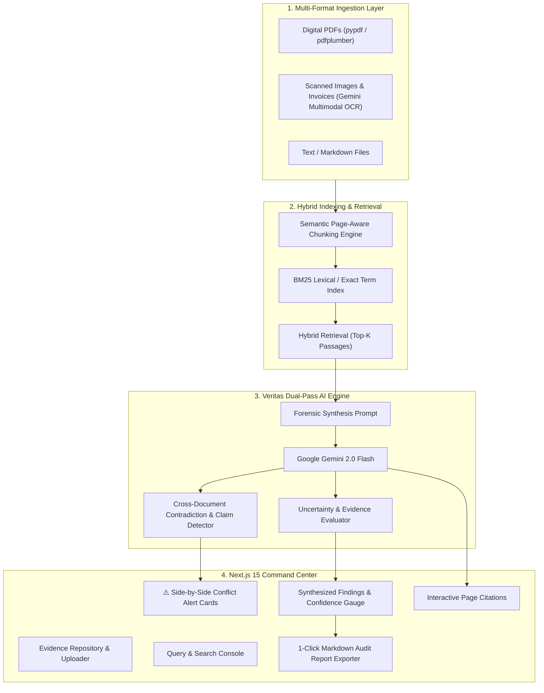

# 🛡️ docV.ai — Intelligent Document Investigator
**Official Problem Statement ID:** `ALG-AI-02` (AI / ML)  
**Hackathon:** ALGOTHON '26 by AlgoXilla  

[](https://fastapi.tiangolo.com)
[](https://nextjs.org)
[](https://tailwindcss.com)
[](https://ai.google.dev)
[]()

---

## 📌 1. Problem Overview & Executive Summary

In enterprise, legal, finance, and investigative workflows, mission-critical information is scattered across hundreds of PDFs, scanned images, contracts, and addendums. Traditional search tools and naive "Chat with PDF" RAG bots suffer from three fatal flaws:
1. **Hallucination:** Confidently making up answers when information is partial.
2. **Blind Consensus:** Failing to notice when two documents (e.g., Contract v1 vs. an Email Addendum vs. an Invoice) directly contradict each other.
3. **Lack of Grounding:** Providing vague answers without exact paragraph and page citations.

### 💡 The Solution: docV.ai
**docV.ai** is an advanced, forensic-grade document investigation suite that ingests multi-format documents (PDFs, Images via Multimodal OCR, TXT, MD), performs hybrid lexical and semantic indexing, and deploys a **dual-pass verification engine** to:
* Answer complex natural language queries with strict page-level source citations.
* **Automatically detect cross-document contradictions & discrepancies** (The 1st-Place Innovation Bonus).
* Calculate an **Uncertainty & Factual Grounding index** with explicit caveats.
* Generate formal, exportable investigation audit reports.

---

## 🏗️ 2. System Architecture



---

## ✨ 3. Core Features & Capabilities

### 🔍 1. Multi-Format Extraction & OCR
* Native extraction for digital PDFs preserving page numbers and table structure.
* Zero-dependency multimodal vision OCR for scanned invoices, receipts, and images using Gemini Vision.

### ⚠️ 2. Cross-Document Contradiction & Conflict Detection (Innovation Bonus)
* Compares claims across multiple files simultaneously.
* Categorizes discrepancies by **Severity** (`HIGH`, `MEDIUM`, `LOW`), displays side-by-side claim boxes, and provides a forensic resolution synthesis (e.g. superseding addendums or billing overages).

### 📊 3. Uncertainty Handling & Grounding Score
* Real-time **0–100% Factual Grounding Score**.
* Explicit breakdown of uncertainty factors (e.g., missing signatures, conflicting dates, unverified clauses) instead of blind hallucinations.

### 📑 4. Strict Page-Level Source Citations
* Every factual claim links to the exact document filename and page number with direct verbatim quotes.

### ⚡ 5. One-Click Demonstration Case
* Pre-configured with a realistic enterprise dispute case (Master Service Agreement vs. Email Addendum vs. Vendor Invoice) for instant, flawless live judging demonstrations.

---

## 🛠️ 4. Tech Stack

* **Frontend:** Next.js 15 (App Router), TypeScript, Tailwind CSS, Lucide Icons.
* **Backend:** Python 3.11, FastAPI, Pydantic v2, Uvicorn.
* **AI & Vision:** Google Gemini 2.0 Flash (via `google-genai` SDK).
* **Indexing:** `rank-bm25` (lexical exact keyword search) + semantic chunking.
* **Document Parsing:** `pypdf`, `pdfplumber`, `Pillow`.

---

## 🚀 5. Getting Started & Setup Instructions

### Prerequisites
* **Node.js:** v18+ (tested on Node v24)
* **Python:** 3.10+ (tested on Python 3.11)
* **Gemini API Key:** From [Google AI Studio](https://aistudio.google.com/)

---

### Quick Launch (Windows)

Simply double-click:
```cmd
run_dev.bat
```
This automatically boots both the FastAPI backend (`http://localhost:8000`) and the Next.js frontend (`http://localhost:3000`).

---

### Manual Launch

#### 1. Backend Setup
```bash
cd backend

# Create & activate virtual environment
python -m venv .venv
# Windows:
.\.venv\Scripts\activate
# Mac/Linux:
source .venv/bin/activate

# Install dependencies
pip install -r requirements.txt

# Configure your API key
copy .env.example .env
# Edit .env and paste your GEMINI_API_KEY

# Start server
uvicorn main:app --reload --port 8000
```
Backend API docs available at: `http://localhost:8000/docs`

#### 2. Frontend Setup
```bash
cd frontend

# Install dependencies
npm install

# Start development server
npm run dev
```
Open [http://localhost:3000](http://localhost:3000) in your browser.

---

## 🧪 6. Live Demo Walkthrough (For Hackathon Judges)

1. Open [http://localhost:3000](http://localhost:3000). Ensure the top-right indicator shows **"Engine Online"**.
2. Click **"Load Demo Case"** in the top navigation bar.
   * This immediately ingests 3 conflicting files: `Master_Service_Agreement_v1.txt`, `Email_Addendum_Scope_March.txt`, and `Vendor_Invoice_INV-089.txt`.
3. The system automatically triggers the forensic query:
   > *"What is the final approved amount and deadline for Milestone 1?"*
4. **Observe the Results:**
   * **Contradiction Alert:** Highlights the price conflict ($50,000 in MSA vs. $72,500 in Addendum vs. $85,000 on Invoice).
   * **Side-by-Side Comparison:** Shows the exact claim and source document for each number.
   * **Synthesized Resolution:** Explains that the email addendum increased the budget to $72,500, but the vendor invoiced an unapproved $85,000.
   * **Uncertainty & Citations:** Displays verified source quotes and page numbers.
5. Click **"Export Report (.md)"** to download the complete forensic audit.

---

## ⚖️ 7. Disclosures & Attribution
* **External APIs:** Google Gemini 2.0 Flash (`google-genai`).
* **Open Source Libraries:** FastAPI, Next.js, Tailwind CSS, Lucide React, PyPDF, PDFPlumber, Rank-BM25.
* **AI-Assisted Development:** Built with AI pair-programming assistance in full compliance with ALGOTHON '26 Official Rule Book Section 4.
